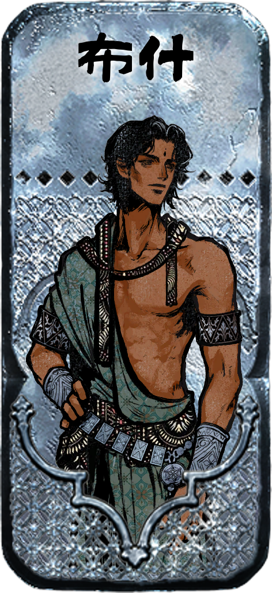
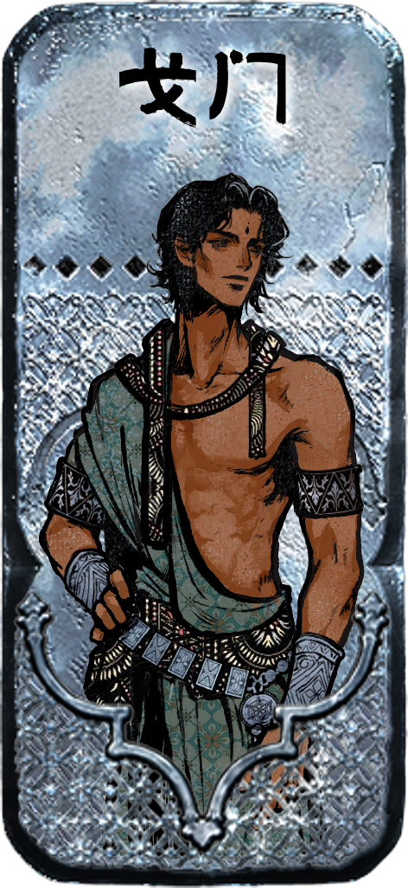
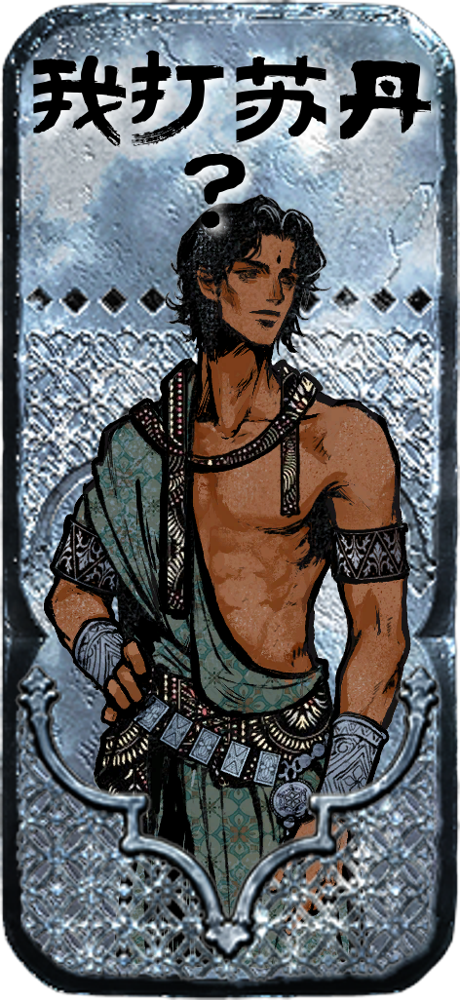

# 苏丹的游戏卡牌（Sultan's Game Cards）

苏丹的游戏的高清卡片图像，通过苏丹的游戏wiki获取素材并制作。  
High-definition card images of Sultan's Game, created using resources from the Sultan's Game Wiki.

图片素材来源（Image Source）：[苏丹的游戏wiki (Sultan's Game Wiki)](https://wiki.biligame.com/sultansgame/%E9%A6%96%E9%A1%B5)  
请Steam购买正版游戏~~并撅巧克力奶苏丹王~~，主控替阿尔图谢谢大家喵（幸福感）  
Please support the official game on Steam! ~~And *play* with Sultan's chocolate chest~~. Main controller Arzu thanks everyone! (Sense of Happiness)

<!-- 让三张图片并排显示，可以用HTML的方式： -->
<p align="center">
  
  
  
</p>

本仓库通过`get_sultan_card_from_wiki.py`脚本，从苏丹的游戏wiki获取图像资源，将卡面和背景png图像组合，并以WIKI风格将文本绘制到图像上（可能是最高清的版本）。  
This repo uses the `get_sultan_card_from_wiki.py` script to fetch image resources from the Sultan's Game Wiki, combine card faces and backgrounds, and render text in a wiki-like style onto the images (possibly the highest quality version available).

---

## 高清png卡牌素材，带透明通道  
## High-Definition PNG Card Assets (with Alpha Channel)

下载地址（Download link）：[Baidu Netdisk 百度网盘](https://pan.baidu.com/s/1zcsuSx1sf6tMN_xv_r2-iA?pwd=xeha)

已收录的牌包括（Included cards）：
- 69张主要角色牌 (69 main character cards)
- 138张次要角色牌 (138 minor character cards)
- 16张苏丹卡 (16 Sultan cards)
- 58张消耗品 (58 consumables)
- 10张状态牌 (10 status cards)
- 100张读物牌 (100 reading cards)
- 166张装备牌 (166 equipment cards)
- 8张地点牌 (8 location cards)
- 7张奇珍牌 (7 rare cards)
- 22张动物牌 (22 animal cards)
- 16张思潮牌 (16 ideology cards)
- 58张部队牌 (58 army cards)
- 159张其它牌 (159 other cards)

所有内容仅供学习与交流，坚决拒绝商用！请维护良好的同人社区环境！  
All content is for learning and communication only. Strictly no commercial use! Please help maintain a healthy fan community!

---

## 快速地替换文本  Quickly Replace Card Text

可以通过下载上面的素材后解压，运行脚本来替换文本。  
You can extract the downloaded assets above and run the script to replace the text.

例如“我打苏丹”这张图片是这样生成的：  
For example, the "我打苏丹" image is generated like this:
```
python write_own_text.py \
--image_path sultan_card_images/characters/主角/merged.png \
--save_path me.png \
--ttf 汉仪杰龙桃花源.ttf \
--text 我打苏丹？
```
`image_path`对应素材图像地址，`save_path`对应存储的地址，`ttf`对应字体地址，`text`对应你想要输入的文本。  
`image_path` is the path to the source image, `save_path` is the path to save the result, `ttf` is the font file path, and `text` is the text you want to input.

游戏内使用的字体是汉仪杰龙桃花源.ttf，支持正版哦  
The in-game font is `汉仪杰龙桃花源.ttf`(For Chinese game version). Please support the official font!

实现很简单所以~~有人能给我写个github.io的前端玩吗~~  
